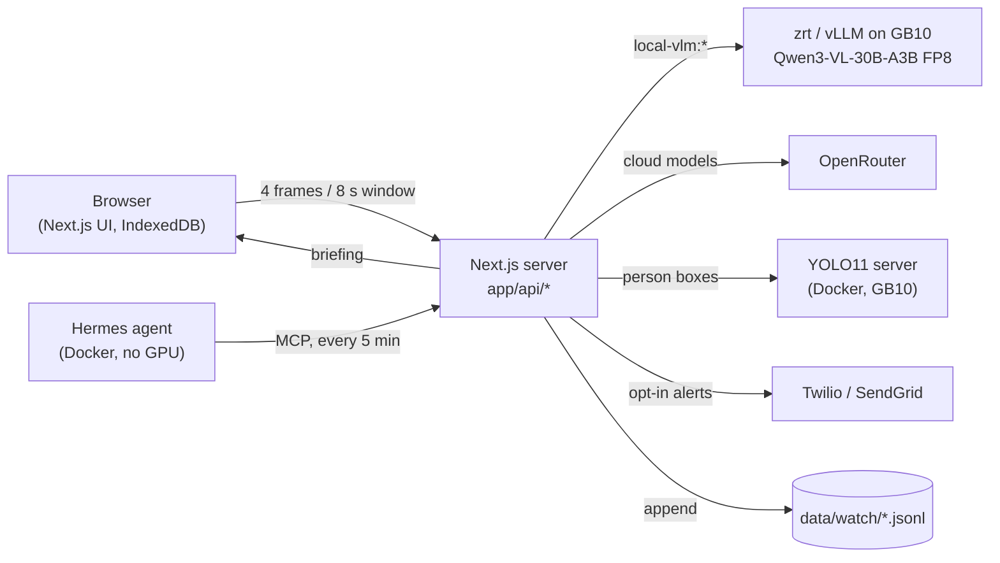

# KryptonxWatch (Sentinel Machines)

KryptonxWatch is a security-video review app for retail stores. The product name in the UI is **Sentinel Machines**. You upload a recording or point it at a live feed. A vision-language model (VLM) looks at short windows of video and flags suspected incidents (shoplifting, robbery, fighting and others) with a time range, a written scene log and a box around the person involved. A person then reviews each one. Everything is built to run on a single **HP ZGX Nano (NVIDIA GB10)**.

The app follows the idea of [HawkWatch](https://github.com/Grace-Shao/Treehacks2025) (TreeHacks 2025) and moves the models onto local hardware.

> Every detection is **suspected** until a person reviews it. The system never accuses anyone.

## How it works

1. **Sample.** The browser cuts the video into 8-second windows and grabs 4 frames per window (one every 2 s, at most 512 px wide). Only these frames leave the browser.
2. **Route.** The server (`webapp/app/api/analyze`) sends each window to the selected model: a local model on the GB10, or a cloud model through OpenRouter.
3. **Describe.** The model answers in JSON: a one-line scene summary plus incidents with category, severity, confidence, time and a rough box.
4. **Ground.** If a YOLO person detector is running, the server snaps each box to the person the model points at and follows that person across the window's frames.
5. **Merge.** Consecutive windows with the same category merge into one detection on the timeline.
6. **Review.** Detections land in a review queue. A person confirms or dismisses them.
7. **Alert (opt-in).** Owner alerts by SMS, WhatsApp or email (Twilio / SendGrid) are off unless configured, have a severity floor and are capped per hour.
8. **Brief.** A [Hermes](https://hermes-agent.nousresearch.com) watch agent reads the server's feed log every 5 minutes (plus an hourly digest) and posts a short briefing to `/overview`. Every highlight must cite real detection IDs.

## Architecture



Two published pages go into more detail:

- [Current architecture on the GB10](https://claude.ai/artifact/SGkdFg7v8faiQ6wqSVcLKo): what runs today.
- [Cloud blueprint](https://claude.ai/artifact/3MyeD9YsLmk2b8mNbU1Keo): a **future plan** for many stores. It has not been built.

## Models

The product shows one model name: **Sentinel Machines v1** (`sentinel-machines-v1`). It is a display alias, not a separate model. `VLM_MODEL_ALIASES` in `webapp/.env.local` maps it to whichever model serves it.

| Where | Model | How it is served |
|---|---|---|
| Local (GB10) | Qwen3-VL-30B-A3B-Instruct, FP8 | HP Z Runtime (`zrt`, a vLLM wrapper), label `qwen3-vl-30b-a3b` |
| Cloud | Any OpenRouter model, e.g. `google/gemini-2.5-flash` | OpenRouter, OpenAI-compatible API |
| Boxes | YOLO11 person detector (n / m) | `model/YOLO/src/yolo_server.py` in the `kryptonx/yolo:dev` container |
| Watch agent | `qwen/qwen3.8-flash` (text) | OpenRouter, called by Hermes |

**No model in the current architecture is fine-tuned.** The next milestone is a LoRA fine-tune of Qwen3-VL-30B-A3B on human-written labels (UCA sentences plus hand-marked theft times). It is Phase 5 of [model/.plans/local-vlm-quality.md](model/.plans/local-vlm-quality.md) and has not started.

Gemini 2.5 Flash is used only as a benchmark, never as a teacher for training, because Google's terms restrict training on its outputs.

### Earlier experiment: Qwen3.8-27B shoplifting LoRA

The team trained a LoRA on Qwen3.8-27B as a yes/no shoplifting scorer (3 seeds). Its gain over the zero-shot model was not conclusive (ΔAUROC +0.027, every 95% CI includes 0), with worse event localisation. It is not part of the current architecture. See [the study plan](model/Qwen3.8-27B-INT4/plans/shoplifting-study.md) and [the model card](model/Qwen3.8-27B-INT4/runs/qwen38/exp3/MODEL_CARD.md).

## Results

All numbers come from the app's own analysis pipeline on UCF-Crime clips. Full tables: [model/openrouter-bakeoff/README.md](model/openrouter-bakeoff/README.md) and [model/.plans/local-vlm-quality.md](model/.plans/local-vlm-quality.md).

**Bake-off v1** (36 clips: 18 crime, 18 normal):

| Model | Score | Balanced acc. | Right crime named | Normal clips false-alarmed | Timed events hit |
|---|---|---|---|---|---|
| Gemini 2.5 Flash (benchmark, cloud) | 75% | 81% | 83% | 33% | 5/6 |
| **Qwen3-VL-30B-A3B FP8 (local, GB10)** | 69% | 81% | 61% | 22% | 3/6 |
| Qwen3.8-27B (OpenRouter) | 64% | 69% | 28% | 0% | 1/6 |

**Bake-off v2** (65 fresh clips, cut around each crime; OpenRouter runs): Qwen3-VL-30B-A3B 80%, Qwen3.8-27B 65%, Gemini 2.5 Flash 69% (it false-alarmed on 53% of normal clips).

How to read this:

- *Score* is the mean of "crime clips where the right crime is named" and "normal clips with no alarm".
- The sets are small (one clip is 5 to 6 points on v1). Differences under about 10 points are noise.
- The local FP8 model scores at least as well as the same model on OpenRouter, so quantisation lost nothing measurable.
- Where open models fall short is naming the right crime, especially shoplifting in low-resolution footage.

## Quick start

Requirements: Node 18+ for the web app; Docker; the GB10 with HP Z Runtime for local models.

**1. Web app**

```bash
cd webapp
npm install
cp .env.example .env.local   # model settings; alert and watch-agent settings are in .env.local.example
npm run dev                  # http://localhost:3000
```

Set `VLM_BASE_URL`, `VLM_API_KEY` and `VLM_MODEL` for a cloud model, or `LOCAL_VLM_BASE_URL` and `LOCAL_VLM_MODELS` for a local one. Without a model, uploads save but are not analysed. Details: [webapp/README.md](webapp/README.md).

**2. Local model on the GB10** (about 55 GB of shared memory with KV cache; starts in about 3 minutes)

```bash
sg zrt -c 'zrt serve hf:Qwen/Qwen3-VL-30B-A3B-Instruct-FP8@d9748a51ae66 --label qwen3-vl-30b-a3b --gpu-memory-fraction 0.45 -- --max-model-len 16384 --limit-mm-per-prompt '"'"'{"image":8,"video":1}'"'"''
```

Then set `LOCAL_VLM_BASE_URL=http://127.0.0.1:8080/v1` and `LOCAL_VLM_MODELS=qwen3-vl-30b-a3b`. Check with `sg zrt -c 'zrt services'`.

**3. YOLO person boxes** (optional; set `YOLO_BASE_URL=http://127.0.0.1:8090`)

```bash
docker run --rm --runtime=nvidia --gpus all -p 127.0.0.1:8090:8090 \
  -v /srv/kryptonx-data/models/yolo:/weights:ro -v "$PWD":/workspace -w /workspace kryptonx/yolo:dev \
  python model/YOLO/src/yolo_server.py --weights /weights/yolo11m.pt --host 0.0.0.0
```

The image is built from `model/YOLO/env/Dockerfile`. On a laptop: `pip install ultralytics && python model/YOLO/src/yolo_server.py`.

**4. Hermes watch agent** (optional; needs an OpenRouter key in `webapp/.env.local`)

```bash
ops/hermes/setup.sh   # safe to re-run; adds WATCH_AGENT_TOKEN, starts the container, schedules briefings
ops/hermes/stop.sh    # stop it
```

Restart the web app after the first run so it picks up the token. See [ops/hermes/README.md](ops/hermes/README.md).

## Repository map

| Path | What |
|---|---|
| [`webapp/`](webapp/README.md) | Next.js 15 dashboard and API routes (analysis, assistant, summary, alerts, MCP endpoint) |
| [`model/`](model/README.md) | Model work, one folder per model |
| [`model/.plans/local-vlm-quality.md`](model/.plans/local-vlm-quality.md) | Active plan: a local model as good as Gemini 2.5 Flash |
| [`model/openrouter-bakeoff/`](model/openrouter-bakeoff/README.md) | Model bake-off on the app's pipeline; raw replies in `results*/` |
| `model/Qwen3.8-27B-INT4/` | Shoplifting study and the Qwen3.8-27B LoRA experiment |
| `model/YOLO/` | Person-box server, snapping and box review tools |
| `model/GLM-4.5-VL/` | GLM-4.5V arm (skipped) and the shared `kryptonx/glm:dev` container |
| `model/study/v1/` | Study splits, leak audit and hand-marked theft times |
| `model/sonakshi/` | A teammate's data-prep work and working rules |
| [`ops/hermes/`](ops/hermes/README.md) | Hermes watch agent: setup, stop and the agent's skill |
| [`docs/`](docs/README.md) | Data contract and archived plans |
| [`data/`](data/README.md) | Local data (git-ignored): test clips, review pages, feed log |
| `AGENTS.md`, `webapp/CLAUDE.md` | Instructions for coding agents working in this repo |

## Data and licences

- **UCF-Crime** videos are the test and training source. Videos, frames and weights are never committed.
- **UCA** (UCF-Crime Annotation, CVPR 2024) supplies about 23.5k human-written, timestamped sentences. Its licence allows **academic and research use only**, which limits commercial use of any model trained on it.
- **MERL Shopping** supplies normal shopping footage as hard negatives.
- Bake-off clips and the study's test cohort are test data. They are never used for training or tuning.

## Principles

- **Suspected until reviewed.** The UI, alerts and agent briefings all say "suspected". Simulated sample footage is labelled as simulated.
- **Keys stay on the server.** API keys and alert credentials live in `webapp/.env.local` (git-ignored) and are only read by `app/api`.
- **Minimal data leaves the browser.** Only sampled frames are sent for analysis. Detections are stored in the browser's IndexedDB.
- **One large GPU job at a time.** The GB10's 121 GiB of memory is shared by CPU and GPU and by several users. Serve a model *or* train, never both, and stop services when done.
- **Plans before big work.** Approved plans live in `webapp/.plans/` and `model/.plans/`; finished or dropped ones move to [`docs/archive/`](docs/archive/README.md).

## Team

shravan, sonakshi, shreyas, vidushi, chaitanya.
