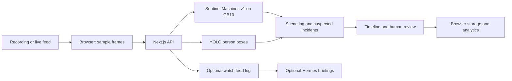

# Sentinel Machines

**Retail security video analysis, running on the NVIDIA GB10.**

Sentinel Machines turns recorded video and live feeds into timestamped, reviewable security events. The dashboard brings together suspected incidents, a scene log, person boxes, an evidence-linked assistant, and operator review in one place. This repository is named **KryptonxWatch**.

**Sentinel Machines v1** is the team's fine-tuned **Qwen3-VL-30B-A3B** model for retail security video analysis, deployed on an **HP ZGX Nano / NVIDIA GB10**. It supports the application's incident-understanding workflow; YOLO supplies person localization and tracking. See the [model documentation](model/sentinel-machines-v1/README.md) for task coverage, deployment identity, and the distinction between v1 and historical benchmark results.

## What the application does

- Analyze uploaded recordings or monitor a webcam and replay feeds.
- Flag suspected shoplifting, theft, robbery, pickpocketing, fighting, vandalism, visible guns, kiosk nonpayment, medical emergencies, and suspicious activity.
- Review a timeline with scene descriptions, confidence, person boxes, and event timestamps.
- Ask questions about a recording and follow timestamp references back to the evidence.
- Review or dismiss detections, inspect aggregate analytics, and export results.
- Enable optional owner notifications and scheduled watch-agent briefings.

Detections remain **suspected until reviewed by a person**. Sample footage and simulated responses are identified in the application. Supported categories describe the interface and analysis scope; they are not per-category accuracy guarantees.

## How it works



The default VLM pipeline samples four frames over each eight-second window. Server routes call an OpenAI-compatible model endpoint, parse the response, optionally refine boxes with YOLO, and return results to the browser. Consecutive matching incidents are merged into timeline events.

Local model endpoints keep core video inference on the GB10. OpenRouter comparisons, Hermes, and external notifications are optional integrations with their own data flows; see [architecture](docs/architecture/README.md).

## Quick start

Run these commands from the repository root. Use a Node.js version compatible with the pinned Next.js 15 dependencies and npm; the team's host uses Node 18. Install model-serving dependencies only on the inference machine.

```bash
cd webapp
npm ci
# Create a configuration file only if one does not already exist.
test -f .env.local || cp .env.local.example .env.local
npm run dev
```

Open `http://localhost:3000`. With no model configured, you can explore simulated samples; uploaded footage requires a configured model to generate detections.

For an existing GB10 service, configure `webapp/.env.local` with the endpoint and **actual served model name**. This example uses the team's service label:

```dotenv
VLM_BASE_URL=http://127.0.0.1:8080/v1
VLM_MODEL=qwen3-vl-30b-a3b
LOCAL_VLM_BASE_URL=http://127.0.0.1:8080/v1
LOCAL_VLM_MODELS=qwen3-vl-30b-a3b
# Optional person-box service:
YOLO_BASE_URL=http://127.0.0.1:8090
```

Restart the app after configuration changes. Select the local VLM option in Settings. The service label must point to the intended checkpoint; a display name alone does not load an adapter. Full setup and troubleshooting: [web app](webapp/README.md) and [operations](ops/README.md).

## Repository guide

| Area | Contents |
| --- | --- |
| [Web app](webapp/README.md) | Dashboard, API routes, configuration, and checks |
| [Documentation](docs/README.md) | Architecture, API contract, and contribution guide |
| [Models](model/README.md) | Sentinel Machines v1, auxiliary models, and earlier experiments |
| [Sentinel Machines v1](model/sentinel-machines-v1/README.md) | Model overview, task coverage, and release provenance |
| [YOLO](model/YOLO/README.md) | Person detection, box refinement, and pose service |
| [Evaluation](model/openrouter-bakeoff/README.md) | Benchmark methodology, saved results, and reproduction |
| [Study data](model/study/README.md) | Splits, labels, and leakage controls |
| [Operations](ops/README.md) | GB10 services and optional integrations |
| [Local data](data/README.md) | Working data layout and storage conventions |

## Development

```bash
cd webapp
npm run lint
npm run typecheck
```

Use `npm run test:e2e:ci` for changes to upload, review, analytics, or persistence. It isolates its servers from the normal development port and uses a fake notification service. See the [contribution guide](docs/contributing/README.md).

## Data and evaluation

Dataset videos, model weights, credentials, and local working data stay outside Git. Study manifests and evaluation summaries are kept so results can be inspected. Dataset source terms are recorded with the shared data; check them before reusing data or distributing trained weights.

Historical Qwen3-VL base-model and Qwen3.8 adapter results are documented separately from Sentinel Machines v1. They should not be presented as v1 release metrics. See [evaluation](model/openrouter-bakeoff/README.md) and [study data](model/study/README.md).

## Team

Built by **Shravan, Sonakshi, Shreyas, Vidushi, and Chaitanya**. The stack brings together Qwen, YOLO, Next.js, HP Z Runtime, and an optional Hermes watch agent.
